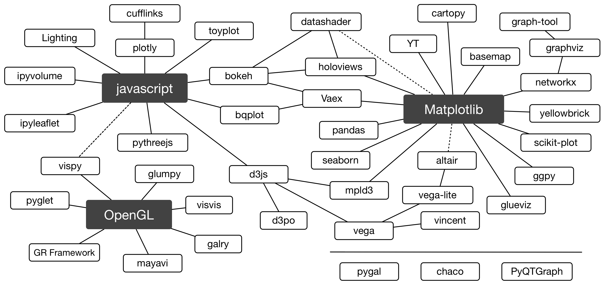

# Python Visualization Landscape

A **clickable** adaptation the Python Visualization Landscape slide from Jake
VanderPlas' keynote at Pycon 2017. Made with Omnigraffle.

Visible at http://rougier.github.io/python-visualization-landscape/landscape-colors.html

Slides: https://speakerdeck.com/jakevdp/pythons-visualization-landscape-pycon-2017  
Video: https://www.youtube.com/watch?v=FytuB8nFHPQ

